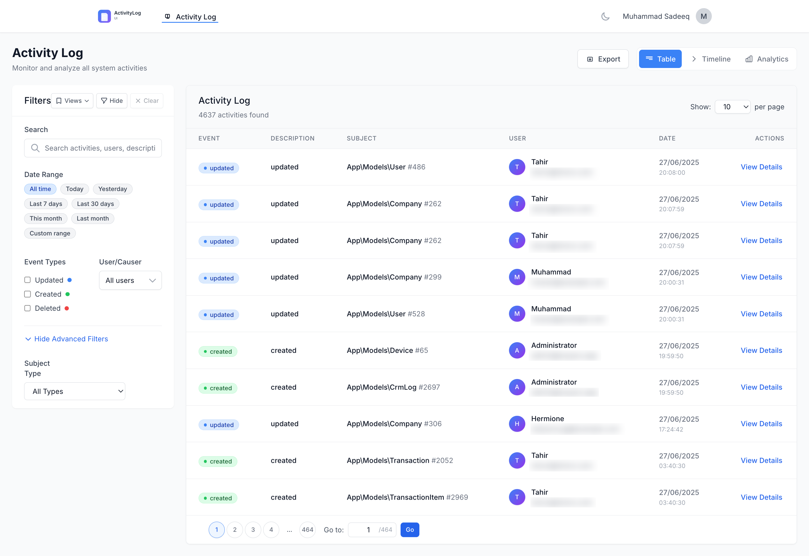

<div align="center">

# ✨ Spatie Activitylog UI

[](https://packagist.org/packages/mayaramyadav/spatie-activitylog-ui)
[](https://packagist.org/packages/mayaramyadav/spatie-activitylog-ui)
[](LICENSE)

**A beautiful, modern, and lightning-fast user interface for [Spatie's Laravel Activitylog](https://github.com/spatie/laravel-activitylog).**

</div>

---

> [!NOTE]
> This package provides an elegant dashboard and analysis interface. It operates securely on top of your existing `activity_log` table and assumes you already have Spatie's package installed and logging data.

<div align="center">
  
</div>

## 🚀 Key Features

- **📊 Comprehensive Dashboards**: View intuitive timeline interfaces, aggregated analytics, and detailed data tables. 
- **🔎 Powerful Filtering**: Instantly search by exact dates, specific events, subjects, causers, and models.
- **💾 Saved Views**: Save your favorite dashboard queries and share default views with your team.
- **⚡ Zero Build Steps**: Styled beautifully with Tailwind CSS and powered by Alpine.js natively—no NPM commands required!
- **🛡️ Rock-Solid Security**: Built-in authorization gates, flexible middleware support, and granular user/role whitelists.
- **📥 Robust Exporting System**: Export millions of records safely to CSV, JSON, Excel (XLSX), or PDF with built-in Laravel Queue background jobs.

## 🛠️ Requirements

Before installing, ensure your server meets the following requirements:

- **PHP**: `^8.3`
- **Laravel**: `11.x` | `12.x` | `13.x`
- **Spatie Activitylog**: `^5.0`

### Optional Export Dependencies
If you wish to export to Excel or PDF, simply install the required packages. The UI gracefully falls back to CSV if these are missing.

```bash
composer require maatwebsite/excel barryvdh/laravel-dompdf
```

## 📦 Installation

1. **Install the package via Composer:**

   ```bash
   composer require mayaramyadav/spatie-activitylog-ui
   ```

2. **Publish Configuration:** (Optional but recommended)

   ```bash
   php artisan vendor:publish --provider="MayaramYadav\SpatieActivitylogUi\SpatieActivitylogUiServiceProvider" --tag="spatie-activitylog-ui-config"
   ```

3. **Publish Assets & Views:** (Optional if you wish to override styling)

   ```bash
   php artisan vendor:publish --provider="MayaramYadav\SpatieActivitylogUi\SpatieActivitylogUiServiceProvider" --tag="spatie-activitylog-ui-assets"
   php artisan vendor:publish --provider="MayaramYadav\SpatieActivitylogUi\SpatieActivitylogUiServiceProvider" --tag="spatie-activitylog-ui-views"
   ```

4. **Verify Database Configuration:**
   If you have not already migrated Spatie's activity log, run:
   
   ```bash
   php artisan vendor:publish --provider="Spatie\Activitylog\ActivitylogServiceProvider" --tag="activitylog-migrations"
   php artisan migrate
   ```

You are now ready to go! 🎉 Visit **`/spatie-activitylog-ui`** in your browser to access the dashboard.

## ⚙️ Configuration

Your `config/spatie-activitylog-ui.php` file dictates the entire appearance and permissions of the package. 

### Core Settings
```php
'route' => [
    'prefix' => 'spatie-activitylog-ui', // The root URL of the UI
    'middleware' => ['web', 'auth'],     // Who can access the base route
],
```

### Authorization (Gates & Access Control)
By default, the package is locked down out of the box.

```php
'authorization' => [
    'enabled' => true,
    'gate'    => 'viewActivityLogUi', // Intercept via app/Providers/AuthServiceProvider.php
],

'access' => [
    'allowed_users' => ['admin@example.com'], // Or allow specific emails natively
    'allowed_roles' => ['super-admin'],       // Or specific Spatie Roles
],
```

## 💡 Analytics & Caching

The dashboard relies on caching to prevent heavy queries from lagging your database when dealing with millions of log rows.

```php
'features' => [
    'analytics' => true,      // Turn on/off the top metrics bar
],

'performance' => [
    'cache_prefix' => 'spatie_al_ui', 
    'eager_load_relations' => ['causer', 'subject'], // Optimize N+1 issues
],
```

## 🖥️ Background Export Jobs

If your database contains millions of rows, attempting to export them via HTTP will likely result in a timeout. We bypass this by queuing exports seamlessly:

```php
'exports' => [
    'enabled_formats' => ['csv', 'xlsx', 'pdf', 'json'],
    
    // Limits
    'max_records' => 100000, 
    
    'queue' => [
        'enabled'   => true, // Run exports via the Laravel Job queue!
        'queue_name'=> 'exports',
    ],
    
    // Get alerted when large exports are ready to download
    'notifications' => [
        'enabled' => true,
        'channels' => ['mail'] 
    ]
],
```

## 🤝 Contributing

We welcome your PRs and feature requests!
Please open an issue to discuss major changes before making a pull request.

## 📝 License

This package is free and open-source software distributed under the terms of the MIT License. See `LICENSE` for details.
